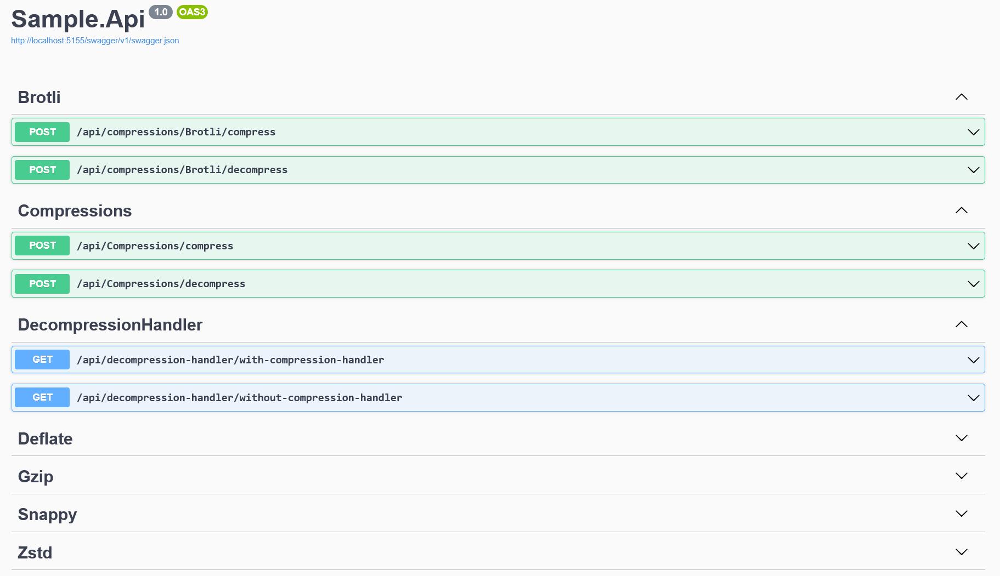

# Sample.Api

The Sample.Api project provides a practical example of how to use the Ogu.Compressions libraries in a real-world ASP.NET Core Web API.
It exposes multiple endpoints through Swagger UI, demonstrating how to compress and decompress data using different algorithms.

Each compression type (Brotli, Deflate, Gzip, Snappy, Zstd) has its own dedicated controller for both compression and decompression operations.

The Compressions controller provides a generic endpoint where you can specify which compression algorithm to use.

The DecompressionHandler demonstrates how HTTP responses are automatically decompressed if a proper decompression handler is configured.
